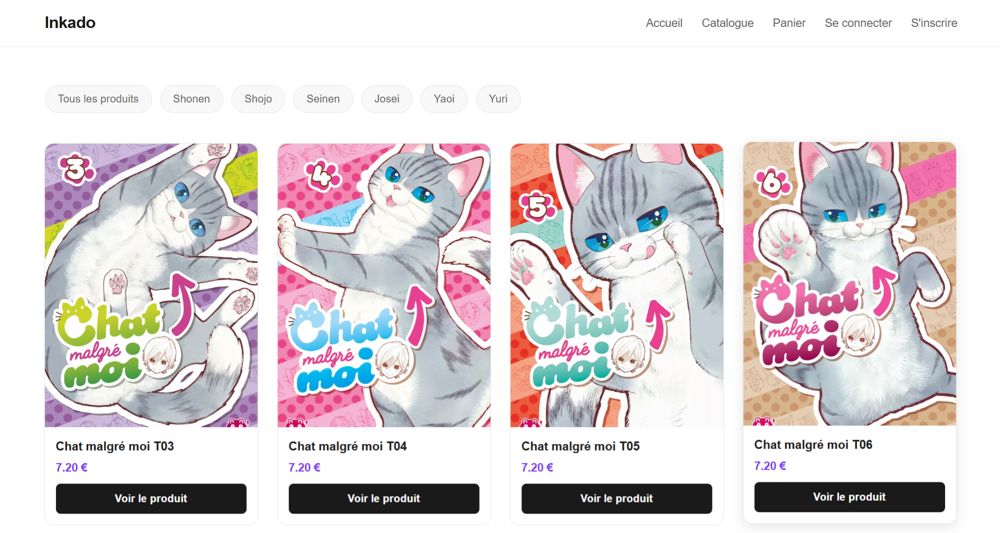
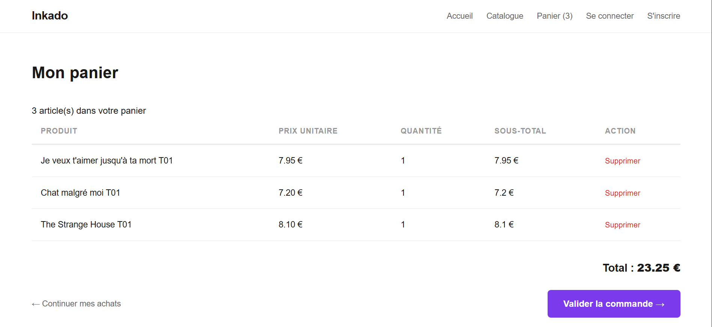
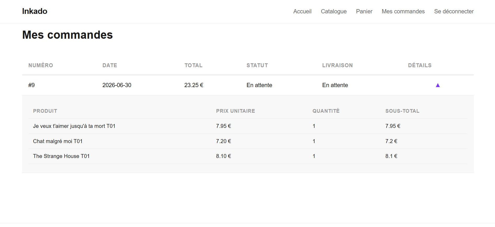
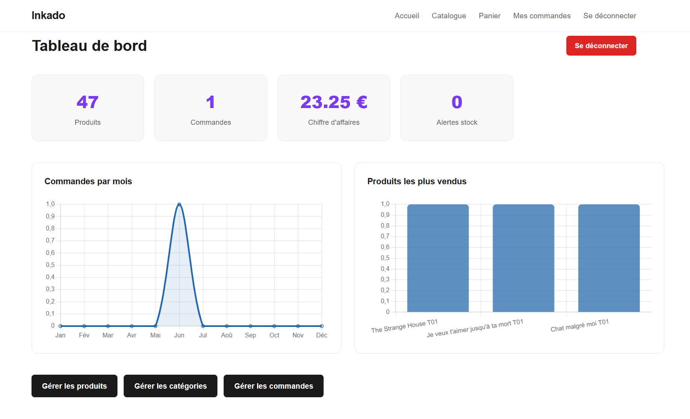
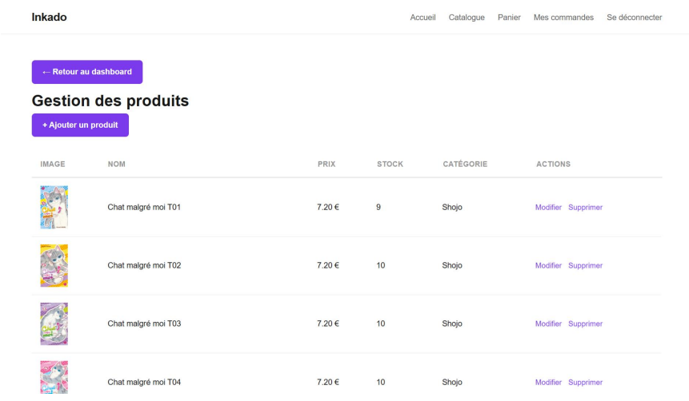
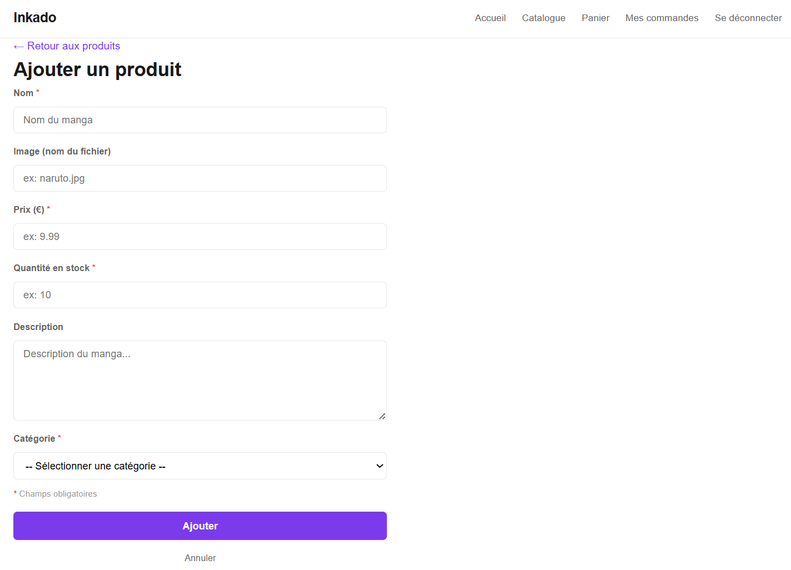
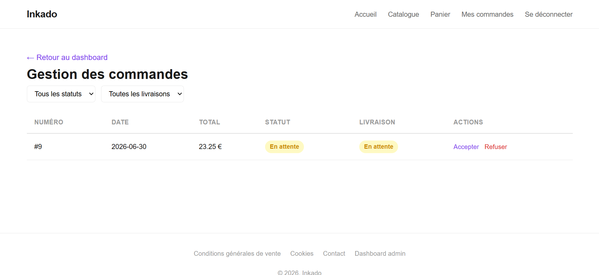

# Inkado — E-boutique de mangas

Projet universitaire réalisé dans le cadre de la licence Informatique (L3) à l'Université Lyon 2.

Site web dynamique de vente de mangas, développé en PHP avec une architecture MVC.

---

## Aperçu

### Espace client

| Page d'accueil | Catalogue des produits avec filtres par catégorie |
|:-:|:-:|
|  |  |

| Fiche détail d'un produit | Panier du client |
|:-:|:-:|
|  |  |

| Historique des commandes avec accordéon ouvert |
|:-:|
|  |

### Espace admin

| Tableau de bord administrateur | Gestion des produits |
|:-:|:-:|
|  |  |

| Formulaire d'ajout/modification de produit | Gestion des commandes avec badges et filtres |
|:-:|:-:|
|  |  |

---

## Technologies utilisées

- **PHP** — logique serveur et routing
- **MariaDB** — base de données relationnelle
- **PDO** — accès à la base de données avec requêtes préparées
- **HTML / CSS** — structure et mise en page du site
- **JavaScript** — interactions côté client
- **Chart.js** — graphiques interactifs du tableau de bord
- **Architecture MVC** — séparation claire des responsabilités

---

## Fonctionnalités

- Catalogue de mangas avec filtrage par catégorie
- Fiches détaillées des produits avec gestion du stock
- Création de compte et authentification des clients
- Panier avec gestion des quantités
- Passage et suivi des commandes
- Historique des commandes avec détail des articles
- Espace d'administration sécurisé
- CRUD complet sur les produits et catégories
- Gestion et réapprovisionnement des stocks
- Gestion des commandes clients
- Tableau de bord avec statistiques et graphiques

---

## Structure de la base de données

La base contient 6 tables :

- `Administrateur` — comptes administrateurs
- `Utilisateur` — comptes clients
- `Commande` — commandes passées par les clients
- `Ligne_Commande` — détail des produits de chaque commande
- `Produit` — mangas disponibles à la vente
- `Categorie_Produit` — catégories des mangas

---

## Architecture du projet

```
eboutique/
├── index.php ← Routeur (point d'entrée unique)
├── init.sql ← Initialisation BDD
├── sessions/ ← Stockage sessions PHP
├── config/
│ └── database.php ← Connexion PDO
├── models/ ← COUCHE MODÈLE
│ ├── Model.php ← Classe parente
│ ├── Utilisateur.php
│ ├── Administrateur.php
│ ├── CategorieProduit.php
│ ├── Produit.php
│ ├── Commande.php
│ └── LigneCommande.php
├── controllers/ ← COUCHE CONTRÔLEUR
│ ├── UtilisateurController.php
│ ├── AdministrateurController.php
│ ├── ProduitController.php
│ └── CommandeController.php
├── views/ ← COUCHE VUE
│ ├── templates/
│ │ ├── header.php
│ │ └── footer.php
│ ├── accueil/
│ │ └── index.php
│ ├── client/
│ │ ├── connexion.php
│ │ ├── inscription.php
│ │ ├── catalogue.php
│ │ ├── produit.php ← Fiche détail produit
│ │ ├── panier.php
│ │ └── commandes.php ← Historique commandes client
│ └── admin/
│ ├── login.php
│ ├── dashboard.php
│ ├── produits.php ← Liste des produits
│ ├── form_produit.php ← Ajout / modification produit
│ ├── categories.php ← Liste des catégories
│ ├── form_categorie.php ← Ajout / modification catégorie
│ └── commandes.php ← Liste des commandes clients
└── public/
├── css/
│ └── style.css
└── images/ ← Photos des produits
```

---

## Auteurs

- **Maély Thomas** - [@Nekokimi0](https://github.com/Nekokimi0)
- Université Lyon 2, 2026
